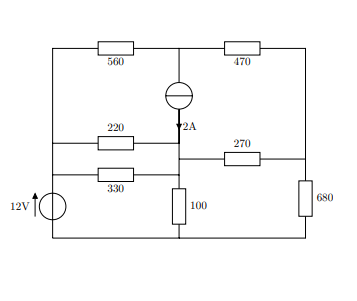

# Dynamic_Memory_C



<div id="top"></div>

<!-- ABOUT THE PROJECT -->
## About The Project

This is a project which deals will memory allocation but also simple DC analysis with passive components solely. 


<p align="right">(<a href="#top">back to top</a>)</p>

<!-- GETTING STARTED -->
## Getting Started

### Prerequisites

You will need [make](https://www.mingw-w64.org/downloads/#mingw-builds) for this.

### Installation

1. Clone the repo
   ```
   git clone https://github.com/chriswebbb/MIPS_Emulator
   ```

2.  Go into the main directory.

3.  Then run make and the .exe will be generated within the same file name as the .c file with the main function. 

4.  Now run the .exe via the command prompt adding the circuit text files name you wish to analyse. There are some example circuits given.

<p align="right">(<a href="#top">back to top</a>)</p>

<!-- LICENSE -->
## License

Distributed under the MIT License.

<p align="right">(<a href="#top">back to top</a>)</p>
